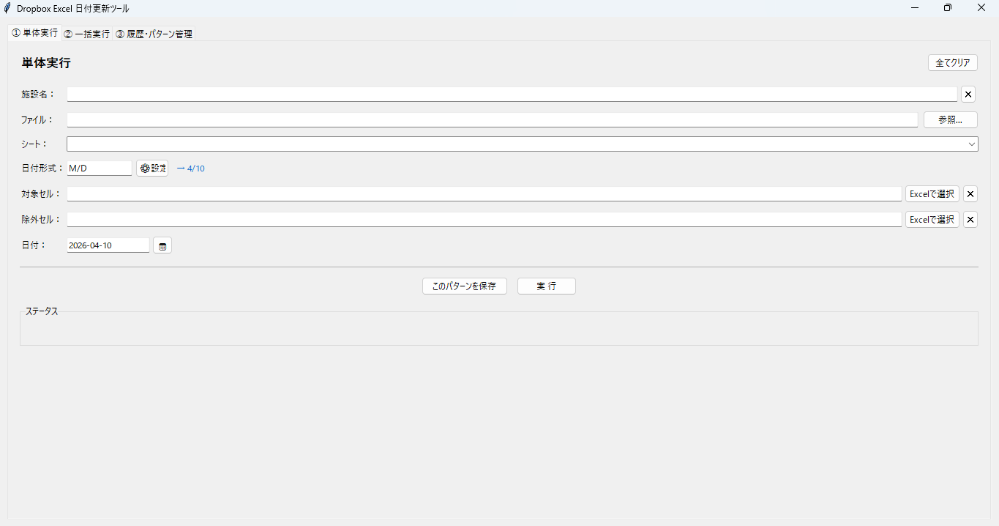
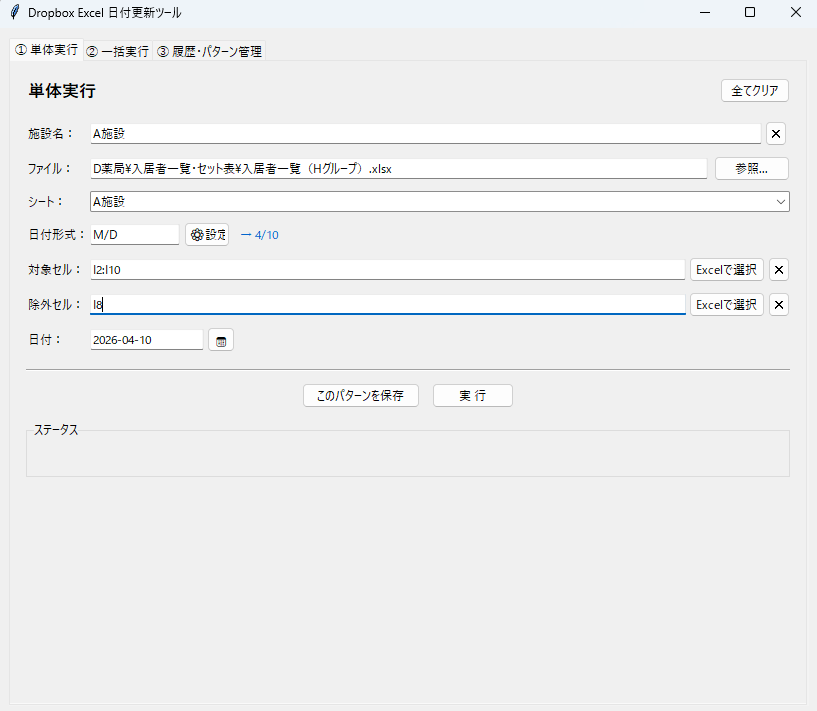
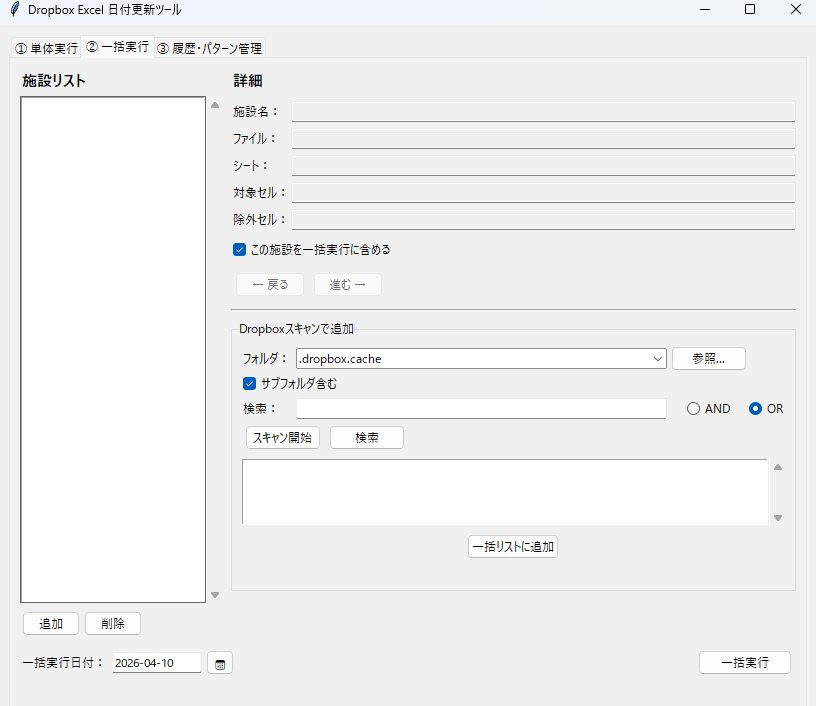
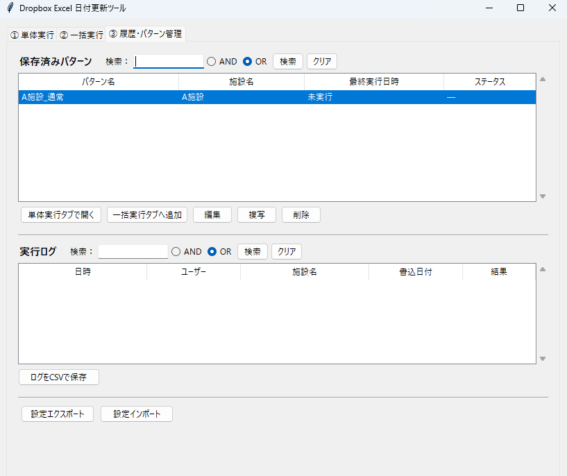

# Dropbox Excel 日付更新ツール

   

Dropbox 内の Excel ファイルに対して、指定セルへ日付を自動入力するツールです。

## ダウンロード

[Releases](../../releases) から最新の `main.exe` をダウンロードして実行するだけで使えます。インストール不要。

**最新バージョン: [v1.2.0](../../releases/tag/v1.2.0)**

## 機能

| タブ | 機能 |
|------|------|
| ① 単体実行 | 1施設分のファイル・シート・セルを指定して日付を書き込む |
| ② 一括実行 | 複数施設をまとめて同一日付で処理する |
| ③ 履歴・パターン管理 | 設定パターンの保存・編集・削除、実行ログの確認 |

### 主な機能詳細

- **Excel連携セル選択**: pywin32 を使って、Excel で選択中のセルをツールに自動反映
- **除外セル**: 対象セルのうち特定のセルだけスキップできる
- **確認ダイアログ（3択）**: 実行前に「はい／いいえ／ファイルを開く」を選択
- **パターン保存**: ファイル・シート・対象セル・除外セルのセットを施設名付きで保存
- **一括実行**: 履歴パターンをチェックして複数施設を一括処理
- **Dropboxスキャン**: フォルダ内の Excel ファイルをスキャン、AND/OR 検索で絞り込み
- **実行ログ**: 日時・ユーザー名・施設名・結果を CSV に自動記録
- **エクスポート/インポート**: パターン設定を JSON で他のPCに移行

## スクリーンショット

| メイン画面 | 単体実行 |
|---|---|
|  |  |

| 一括実行 | 履歴・パターン管理 |
|---|---|
|  |  |

## セットアップ

```bash
pip install -r requirements.txt
```

> `pywin32` は Windows のみ必要です。Excel連携セル選択機能で使用します。

## 初回設定

1. `config.xlsx_date_targets.sample.json` を `config.xlsx_date_targets.json` にコピー
2. 施設名・ファイルパス・シート名を編集
3. `python main.py` で起動

## ファイル構成

```
main.py                              # メインUI（3タブ構成）
config_loader.py                     # JSON/CSV設定マスタ読み込み
excel_updater.py                     # Excelへの日付書き込み
pattern_store.py                     # パターン保存管理（patterns.json）
log_manager.py                       # 実行ログ管理（execution_log.csv）
cell_selector.py                     # pywin32によるExcelセル選択連携
scanner.py                           # DropboxフォルダスキャンとAND/OR検索
requirements.txt                     # 依存パッケージ
config.xlsx_date_targets.sample.json # 設定サンプル
docs/HowToUse_DropboxExcelTool.pdf   # 操作説明書
```

## Git管理について

以下のファイルは `.gitignore` で除外されています（環境固有のため）:

- `config.xlsx_date_targets.json` / `.csv` ← sample からコピーして使用
- `patterns.json` ← ツールが自動生成
- `execution_log.csv` ← ツールが自動生成
- `build/` / `dist/` ← PyInstaller ビルド成果物

## 動作要件

- Windows 10/11
- Python 3.11 以上（ソースから実行する場合）
- Dropbox がインストール済みで `%USERPROFILE%\Dropbox` が存在すること

## 更新履歴

[CHANGELOG.md](CHANGELOG.md) を参照してください。

## ドキュメント

- [INSTALL.md](INSTALL.md) — 詳細セットアップ手順
- [FAQ.md](FAQ.md) — よくある質問・トラブル対応
- [docs/HowToUse_DropboxExcelTool.pdf](docs/HowToUse_DropboxExcelTool.pdf) — 操作説明書（PDF）
- [GitHub Pages](https://slsprivateracksti.github.io/dropbox-excel-date-updater/) — プロジェクトサイト
